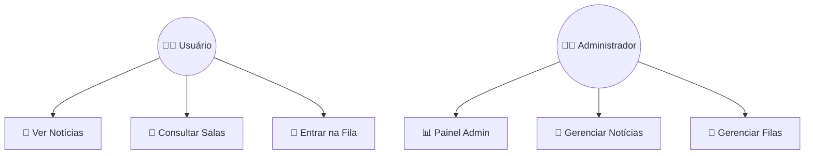
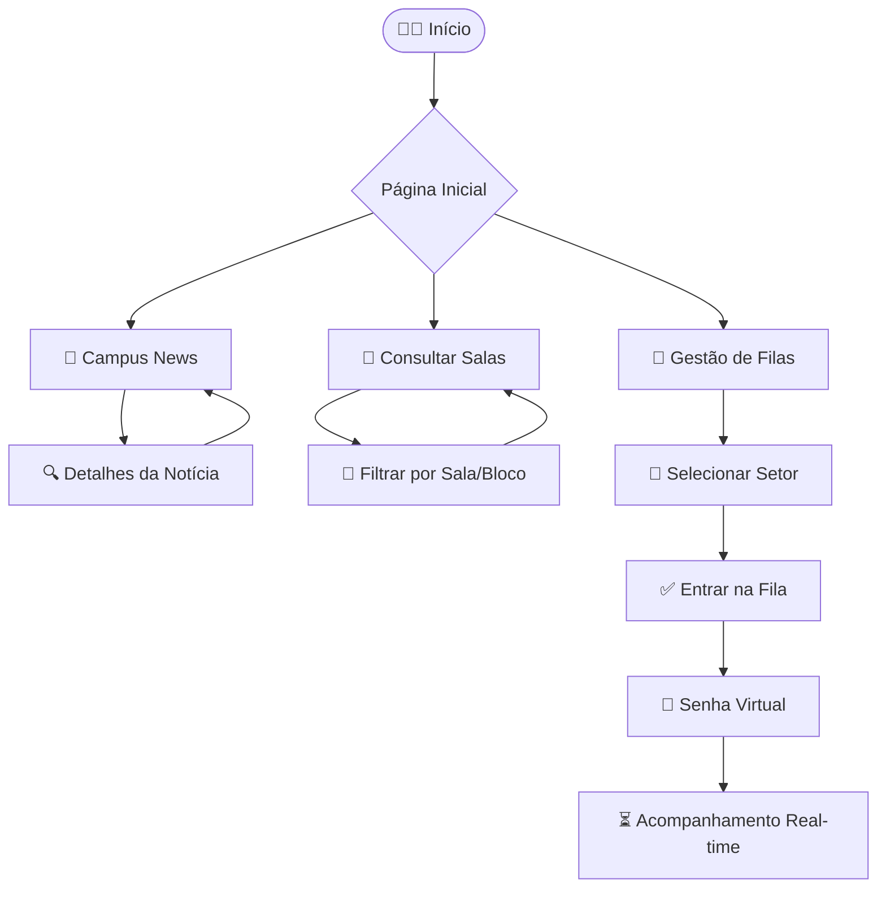

# Campus News - Portal Inteligente Institucional com Gestão de Fluxo Acadêmico

## Parte 1 – Rascunho Digital

### Base do Projeto
- **Nome Oficial:** Campus News - Portal Inteligente Institucional com Gestão de Fluxo Acadêmico
- **Nome Comercial Sugerido:** UniFlow ou Portal Acadêmico Inteligente.
- **Frase de Propósito:** "Conectando o campus, otimizando o tempo e simplificando a vida acadêmica."

### Identidade Visual Inicial
- **Paleta de Cores (Tema Claro Refinado):**
  - Fundo Principal: `#F1F5F9` (Slate 100)
  - Superfícies: `#FFFFFF` (Branco)
  - Texto Principal: `#0F172A` (Slate 900)
  - Azul Darker: `#1D4ED8` (Blue 700)
  - Erro: `#DC2626` (Red 600)
- **Estilo:** Moderno, minimalista, com bordas arredondadas (24px-32px) para um toque amigável e contemporâneo.
- **Tipografia:** Inter (Sans-serif) para legibilidade em telas mobile. JetBrains Mono para dados técnicos e senhas.

### Fluxo do Sistema
1. **Acesso:** Aluno escaneia QR Code espalhado pelo campus.
2. **Splash/Entrada:** Carregamento rápido da marca.
3. **Home:** Escolha entre os 3 módulos principais.
4. **Módulo 1 (Jornal):** Lista de notícias -> Detalhe da notícia -> Inscrição (se evento).
5. **Módulo 2 (Salas):** Filtro -> Lista de resultados -> Status em tempo real.
6. **Módulo 3 (Filas):** Seleção de setor -> Confirmação -> Acompanhamento em tempo real.

### Diagramas do Sistema

#### Diagrama de Casos de Uso

#### Fluxograma do Usuário

---

## Parte 2 – Protótipo Final

### Funcionalidades Detalhadas
- **Centralização de Comunicados:** Feed dinâmico com categorias coloridas. Marcadores de "Urgente" para avisos críticos.
- **Consulta de Salas:** Integração com dados de horários. Filtros por bloco e nome. Status visual (Verde/Laranja/Vermelho).
- **Gestão de Filas:** Algoritmo de média móvel para estimativa de tempo. Senha virtual com posição em tempo real.
- **Dados Analíticos:** Dashboard administrativo com gráficos de tendência e horários de pico para melhor alocação de recursos.

### Diferenciais
1. **Ecossistema Único:** Resolve três problemas distintos em uma única interface progressiva.
2. **Acessibilidade:** Design focado em alto contraste (WCAG AA) e navegação simplificada.
3. **Tomada de Decisão:** Dados reais de fluxo ajudam a administração a otimizar o atendimento.

---

## Guia Rápido para Figma
1. **Componentes:** Crie componentes para `ModuleCard`, `NewsCard`, `RoomItem` e `StatusBadge`.
2. **Auto Layout:** Use Auto Layout em todos os containers com espaçamento de 16px ou 24px.
3. **Frames:** Utilize frames de `375x812` (iPhone 13 mini/11 Pro) para o design mobile-first.
4. **Interações:** Configure transições de "Slide In" para navegação entre telas e "Smart Animate" para o dashboard.
